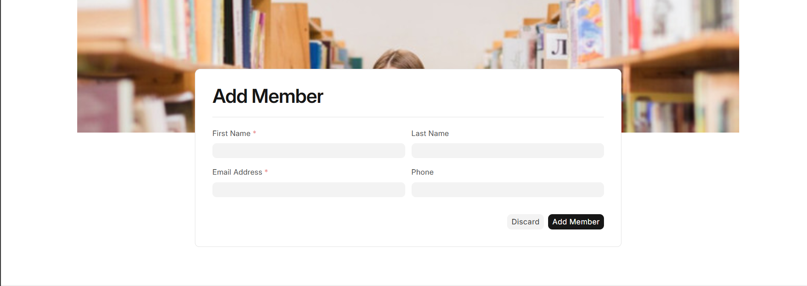

## BookHaven Library Management System

### Overview

Welcome to **BookHaven**, a Frappe framework-based solution designed for efficient management of books and patrons in libraries. Our system ensures streamlined operations, allowing you to focus on enhancing the library experience.

### Features

- **Catalog Management:** Seamlessly add, edit, and delete books with ease.
  
- **Patron Information:** Efficiently manage borrower details and track borrowing history.

- **Book Viewing:** Easily view available books in the library.

- **Import Books:** Import large volumes of book data quickly and efficiently.

- **Issue Books:** Issue books to patrons, with checks on outstanding amounts.

- **Return Books:** Return books while automatically calculating and applying charges for late returns.

- **Membership Management:** Add and manage library members, ensuring up-to-date records.

### Installation

Ensure the Frappe framework is installed. Refer to the [Frappe Installation Guide](https://frappeframework.com/docs/user/en/installation). Make sure you are in the `frappe-bench` directory.

### Installation Steps:

1. **Install the App:**
```bash
   bench get-app https://github.com/vijayan108/Library-Management.git
```

2. **Create a New Site:**

```bash

bench new-site [library-management-app]

```
3. **Install the App in the Site:**

```bash

bench --site [library-management-app] install-app library_management_system
```

4.**Start the App:**

```bash

bench start
Access the app at http://localhost:8000.
```
### Usage

Visit this site to view the books and availability: [https://frappe.selfmade.one/](https://frappe.selfmade.one/)


#### View the Books


#### Import the Books


#### Issue Books Based on the Outstanding Amount


#### Return the Book with Charge Amount


#### Add the Library Member




### License
This project is under the MIT License. Your contributions are valued as we refine the BookHaven Library Management System.